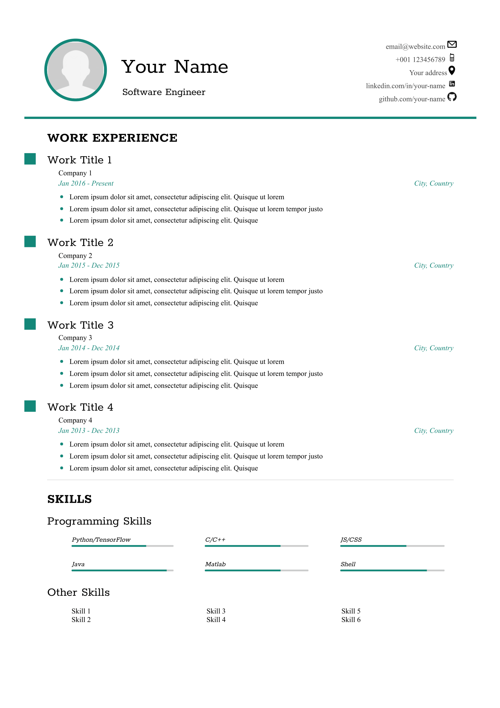

Being a Linux user, making a CV has been a bit of a struggle. I have tried using several free templates in Latex, Google Docs, etc. Eventually, I wanted to try and make one in HTML. 

####Samples

{ width: 50px; border-1px}

####Credits
Some CSS attributes were adapted from Thomas Hardy's [template](http://www.thomashardy.me.uk/free-responsive-html-css3-cv-template) . 
